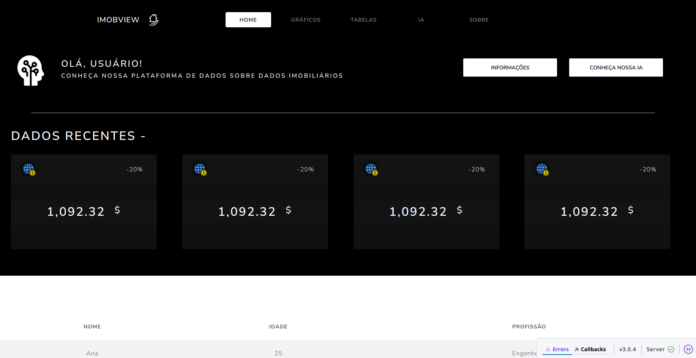

# 🏡 ImbobView

**ImbobView** é uma plataforma interativa construída com [Plotly Dash](https://dash.plotly.com/) que apresenta visualizações dinâmicas sobre os **preços de imóveis ao redor do Brasil**. O objetivo é facilitar a análise de mercado imobiliário por meio de um dashboard intuitivo, acessível e rico em dados.

## 📊 Tecnologias Utilizadas

- [Python 3.10+](https://www.python.org/)
- [Plotly Dash](https://dash.plotly.com/)
- [Pandas](https://pandas.pydata.org/)
- [Docker](https://www.docker.com/)

## 📌 Funcionalidades

- Visualização interativa de preços de imóveis por estado e cidade
- Filtros por tipo de imóvel, faixa de preço e período
- Mapa com distribuição geográfica dos imóveis
- Gráficos de linha, barras e dispersão
- Responsivo e acessível via navegador
- Tabelas com dados atualizados

## 📷 Prévia do Dashboard



## 🛠️ Como Rodar Localmente

1. Clone o repositório:
   ```bash
   git clone https://github.com/seu-usuario/imbobview.git
   cd imbobview
