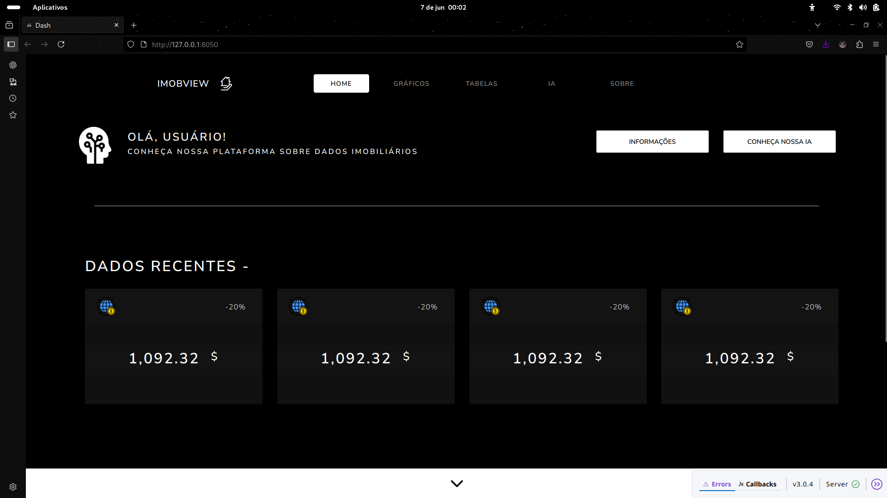

# 🏡 ImbobView

The **README** file is the main document that introduces and explains a project.  
It typically includes the project’s purpose, features, and instructions on how to get started using it.

**ImbobView** is an interactive platform built with [Plotly Dash](https://dash.plotly.com/) that provides dynamic visualizations of **real estate prices across Brazil**. The goal is to simplify real estate market analysis through an intuitive, accessible, and data-rich dashboard.

## 📊 Technologies Used

- [Python 3.10+](https://www.python.org/)
- [Plotly Dash](https://dash.plotly.com/)
- [Pandas](https://pandas.pydata.org/)
- [Docker](https://www.docker.com/)

## 📌 Features

- Interactive visualization of property prices by state and city  
- Filters for property type, price range, and time period  
- Map showing geographic distribution of properties  
- Line, bar, and scatter plots  
- Responsive and accessible via web browser  
- Data tables with up-to-date information  

## 📷 Dashboard Preview



## 🛠️ How to Run Locally

1. Clone the repository:
   ```bash
   git clone https://github.com/seu-usuario/imbobview.git
   cd imbobview
   ```
